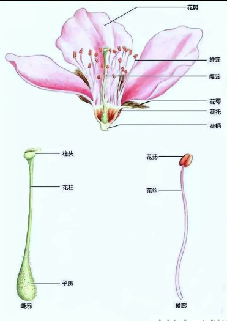
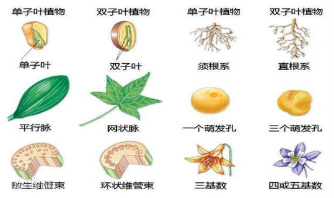

# 被子植物门

真正的花为被子植物独具的主要特征，所以被子植物又叫有花植物。

被子植物通常被分成双子叶植物和单子叶植物两大部分。大致区别如下

| 部位| 双子叶植物| 单子叶植物
|---|---|---|
| 根| 主根发达，多为直根系 | 主根不发达，多为须根系|
| 茎| 维管束呈环状排列，有形成层| 维管束呈星散状排列，无形成层|
| 叶| 具网状脉| 具平行或弧形叶脉|
| 花| 各部分基数通常为5或4，极少3；花粉粒具3个萌发孔| 各部分基数通常为3，极少4；花粉粒具单个萌发孔|
| 胚| 具2枚子叶（极少1、3或4）| 具1枚子叶（或不分化|

参考:

- [百度百科-被子植物门](https://baike.baidu.com/item/%E8%A2%AB%E5%AD%90%E6%A4%8D%E7%89%A9%E9%97%A8/229000?fromModule=lemma_inlink&fromtitle=%E8%A2%AB%E5%AD%90%E6%A4%8D%E7%89%A9%E4%BA%9A%E9%97%A8&fromid=3844546#5_1)