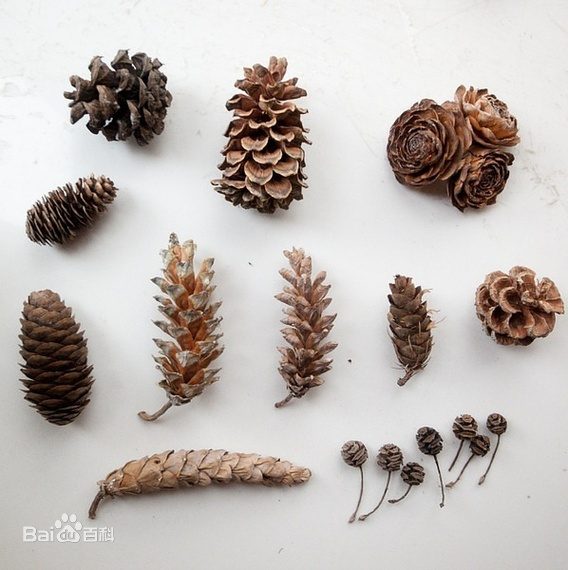
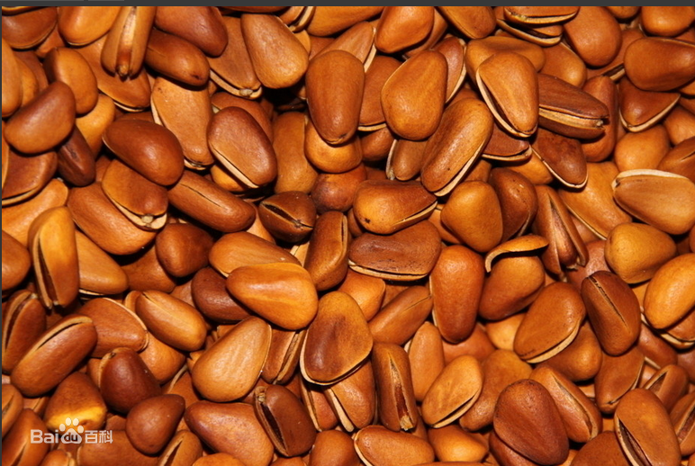

# 松

松塔。

|属性|说明|
| ---- | ---- |
| 别称||
| 属||
| 分布||
| 寿命||
| 外形特征||
| 繁殖||

松子。在中国有巴西松子、东北松子及落水松子，其中落水松子以云贵川大山里的松树结的松子为主。

参考:
- [松子-百度百科](https://baike.baidu.com/item/%E6%9D%BE%E5%AD%90/991718?fromModule=lemma_search-box)
