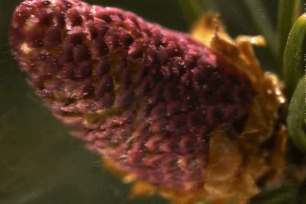

# 松柏纲

松柏纲植物的生殖器官分为雄球花和雌球花两种。雄球花会产生花粉；雌球花在其木质鳞片之间有种子。幼嫩的雄球花之鳞片上长有花粉囊，囊里会产生很多花粉。花粉粒的大小约在五万分之一到五千分之一公分之间，重量是非常轻。当授粉时节来临时，风把花粉从雄球花吹到雌球花上。

这种传粉方式是成功的，但它们必须得产生大量的花粉，才能确保其中有一些可以抵达目的地。(在约1.4忆年前，一些植物找到了更有效的传粉方式，那就是依靠花朵)

有些松柏纲植物的球花是雌雄同株，为了避免同株授粉，雌、雄球花会在不同的时间成熟，并且雌球花会生长在更高的树枝顶端。在花粉成熟的同时，雌球花也做好迎接花粉粒的准备。雌球花会将鳞片打开，裸露出胚珠。胚珠上有一种黏性液体，当花粉抵达时，正好被黏住，避免飞走。

完成授粉后，雌球花的鳞片重新闭合成球果，球果逐渐膨大并保持绿色。在球果里面，花粉会慢慢地渗入胚珠中，而形成一根小管。透过这根小管，精子与卵细胞结合，完成受精作用。在几个月或几年之间，胚珠发育成种子。当种子成熟后，鳞片再次打开，种子可随风传播。种子一旦落地，就萌芽生根，长成一株新的裸子植物。

参考:
- [松柏纲-百度百科](https://baike.baidu.com/item/%E6%9D%BE%E6%9F%8F%E7%BA%B2/6762507?fromModule=lemma_inlink)
- Kindom of Plants(植物王国)-纪录片
