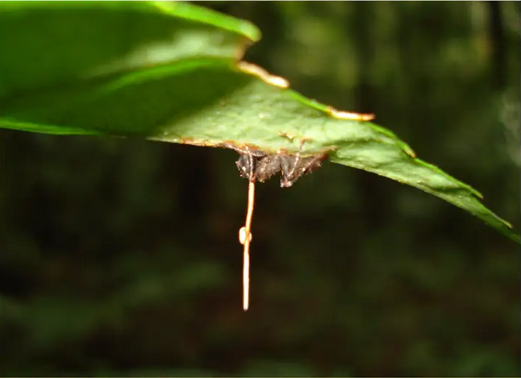
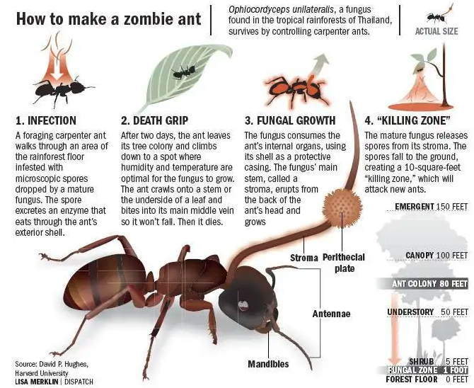

# 偏侧蛇虫草

|属性|说明|
| ---- | ---- |
| 别称| 丧尸真菌|
| 属||
| 生长环境||
| 外形特征||
| 繁殖||

【寄生蚂蚁】主要以莱氏巨山蚁（Camponotus leonardi）或其近亲物种为寄主。偏侧蛇虫草感染蚂蚁后，会控制蚂蚁的肌肉，利用蚂蚁的身体帮助真菌找到适合的生长环境。当蚂蚁感染了这种真菌，就会离开位于树冠层的巢穴或是觅食路径，来到温度与湿度较适合真菌生长的位置，通常是树林下层，蚂蚁寻找一片叶片后，于叶背以大颚紧紧钳住叶脉直至死亡，这通常需要花费4~10天。而这段时间也是真菌的生殖阶段，子实体从寄主的头部长出，破裂并释放孢子感染其他蚂蚁。

真菌的孢子附著后会利用酵素突破蚂蚁的外骨骼。进入蚂蚁体内后，真菌开始扩散，并且释放一种可以影响蚂蚁血腔的化合物，接著取得蚂蚁的身体控制权。被感染后的蚂蚁会产生不定时的抽搐并设法移动到森林底层。蚂蚁会爬上植物的茎，用下颚以异常的力量将自己固定在叶脉上，并留下一个哑铃状的痕迹。被感染的蚂蚁被称作僵尸蚂蚁。

偏侧蛇虫草菌所操控的僵尸蚂蚁大脑并未被真菌侵蚀。真菌只是通过操纵蚂蚁机体动作就能达到自己的目的。换言之，宿主蚂蚁就像是被困在驾驶座上的司机，而真菌控制了汽车轮子。

参考:
- [偏侧蛇虫草-wiki](https://zh.wikipedia.org/zh-hans/%E5%81%8F%E4%BE%A7%E8%9B%87%E8%99%AB%E8%8D%89)
- [僵尸蚂蚁-zhihu](https://www.zhihu.com/question/263627845)
- [Our Planet | Fungus - youtube](https://www.youtube.com/watch?v=ROQrbWkV4HI)
