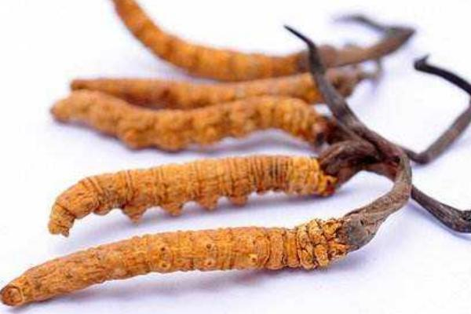

# 冬虫夏草

|属性|说明|
| ---- | ---- |
| 别称||
| 属||
| 生长环境||
| 外形特征||
| 繁殖||

冬虫夏草寄生于蝙蝠蛾幼虫体内。到了冬季，幼虫体内组织、外壳会与菌丝结合成坚硬的菌丝体，因为外表还是如幼虫的外型，这时就被称为“冬虫”，经过一个冬天，到第二年春天来临，菌类的菌丝开始生长，到夏天时从蝙蝠蛾幼虫的头部长出然后突出地面，外观状似植物，长出棒状子囊座并且露出地面形成“夏草”，共同组成了一个完整的“冬虫夏草”。

参考:
- [冬虫夏草-wiki](https://zh.wikipedia.org/wiki/%E5%86%AC%E8%99%AB%E5%A4%8F%E8%8D%89)
