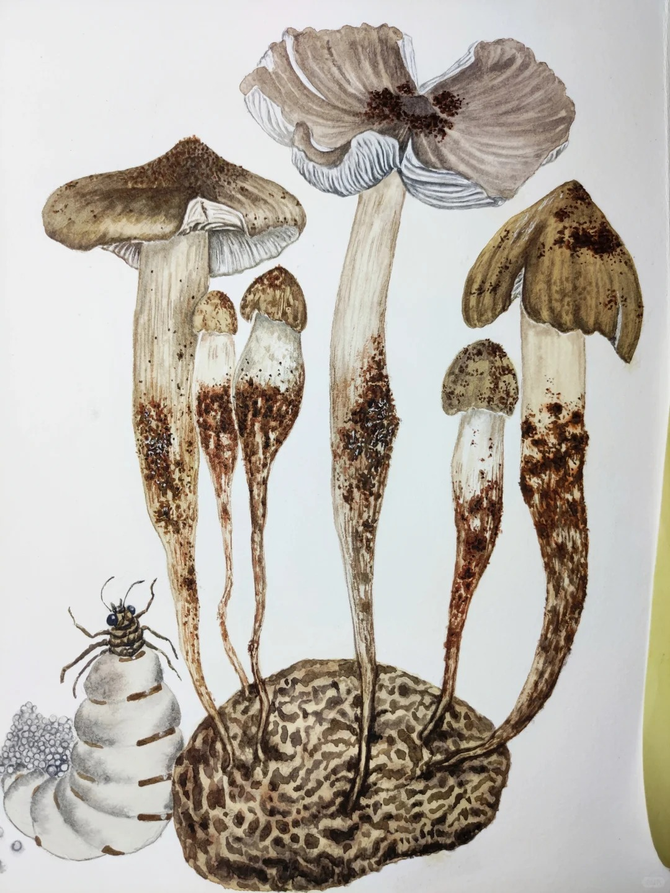

# 鸡枞菌

|属性|说明|
| ---- | ---- |
| 别称||
| 属||
| 生长环境||
| 外形特征||
| 繁殖||

【共生】在自然界，鸡枞菌和白蚁共生，白蚁构筑蚁巢的同时培养了鸡枞菌菌丝体，鸡枞菌的菌丝体在白蚁巢中大量生长，分解有机物形成菌丝体生物量，为白蚁提供高蛋白食物。同时，白蚁通过控制巢体的环境条件（如温度、湿度、pH值等），为鸡枞菌的生长提供了适宜的条件。白蚁通过取水和运输，保持巢体的高含水量，为鸡枞菌的生长创造了恒温、恒湿的环境，白蚁巢中的高二氧化碳浓度和黑暗条件也有利于鸡枞菌菌丝体的生长。

参考:

- [鸡枞菌 - 阿布王太后 - 小红书](https://www.xiaohongshu.com/discovery/item/68a74485000000001c00aebe?source=webshare&xhsshare=pc_web&xsec_token=AB5qzLU0WFD96DbXdQbnj56KvjowcOnkBv1HwuVHIKAI8=&xsec_source=pc_share)