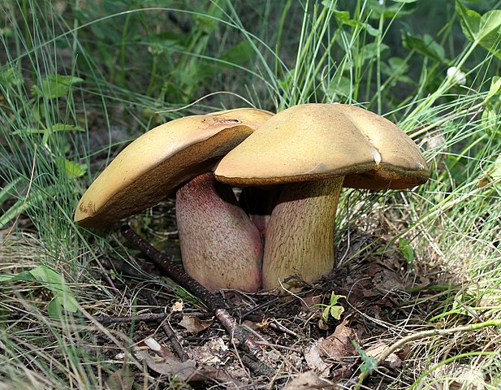

# 红网牛肝菌

|属性|说明|
| ---- | ---- |
| 别称| 见手青|
| 属||
| 生长环境||
| 外形特征||
| 繁殖||

【中毒】见手青是兰茂牛肝菌、玫黄黄肉牛肝菌的统称。用手一按，菌肉里的酸类、酶类释放出来，迅速氧化，由黄变青。如果没做熟就会中毒，导致”小人国幻视症“，可以看到很多活泼的小人儿。

北京安定医院记录的两个见手青中毒病例: 一位患者视野内全是不及33cm的小人儿，穿红戴绿，活泼调皮，患者能听见他们在说话，还有五颜六色的蘑菇立在小人儿之间。另一位患者则看到了小人儿的”兽化版“——无数兔子和松鼠，纷纷涌上来要咬自己。看来，每个人的精神世界不同，小人儿的模样也会不同。除了小人儿，吃了见手青中毒还有别的幻觉。有一对姐弟吃完见手青感觉不对，姐姐开车带弟弟去医院。遇到红灯时姐姐踩了脚刹车，弟弟哭了。因为他觉得自己变成了一杯奶茶，一刹车，奶茶洒了。感觉自己或身边的物体液化，是致幻蘑菇造成的典型幻觉。

参考:
- 云南吃饭的乐子-张辰亮
- [红网牛肝菌-wiki](https://zh.wikipedia.org/zh/%E7%BA%A2%E7%BD%91%E7%89%9B%E8%82%9D%E8%8F%8C)