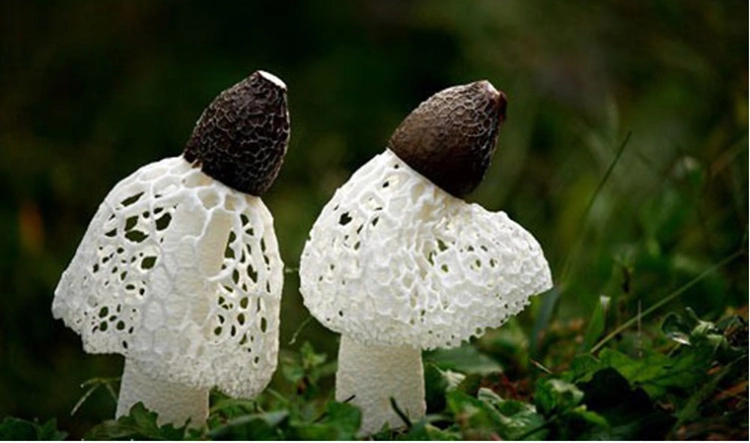
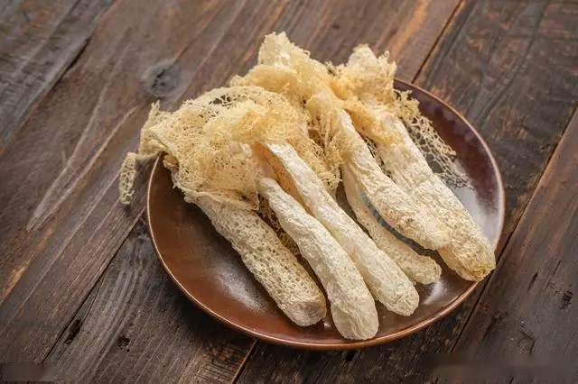

# 竹荪

|属性|说明|
| ---- | ---- |
| 别称| 长裙竹荪|
| 属||
| 生长环境| 生长在竹林中腐朽的竹子及土壤上。|
| 外形特征| 形状略似网状干白蛇皮，它有深绿色的菌帽，雪白色的圆柱状的菌柄，粉红色的蛋形菌托，在菌柄顶端有一围细致洁白的网状裙从菌盖向下铺开，被人们称为“雪裙仙子”、“山珍之花”、“真菌之花”、“菌中皇后”。|
| 繁殖||

是宴席上著名的山珍。

参考:
- [竹荪-百度百科](https://baike.baidu.com/item/%E7%AB%B9%E8%8D%AA/570779)
- [竹荪生长-彭传明pcm-bilibili](https://www.bilibili.com/video/BV1Rq4y157aj/?spm_id_from=333.788.recommend_more_video.0)
