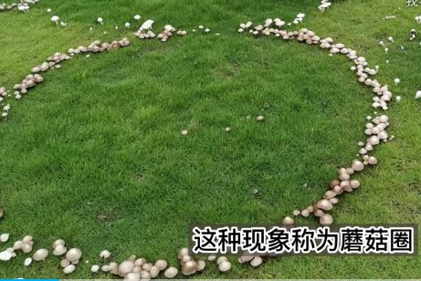

# 真菌界

拉丁学名是Fungi, 也叫蘑菇。

【蘑菇圈】当条件合适时，地下的菌丝会从中央向四周均匀扩散，形成圆形。由于中部菌丝相对衰老，生活力低，所以它们的繁殖器官——子实体，主要在菌丝圈的外周产生，形成蘑菇圈(Fairy ring)。

参考:
- [Documentary - Fantastic Fungi](https://www.bilibili.com/video/BV1Uy4y1q7QK/?spm_id_from=333.337.search-card.all.click&vd_source=741bff59809f9e15c309ef97c7d7c960)
- [蘑菇圈-蘑菇球Mugoture-bilibili](https://www.bilibili.com/video/BV1zt4y1w7cy/?share_source=copy_web&vd_source=fcf7bbddc2ffd7f073481728ff8f0f3c)